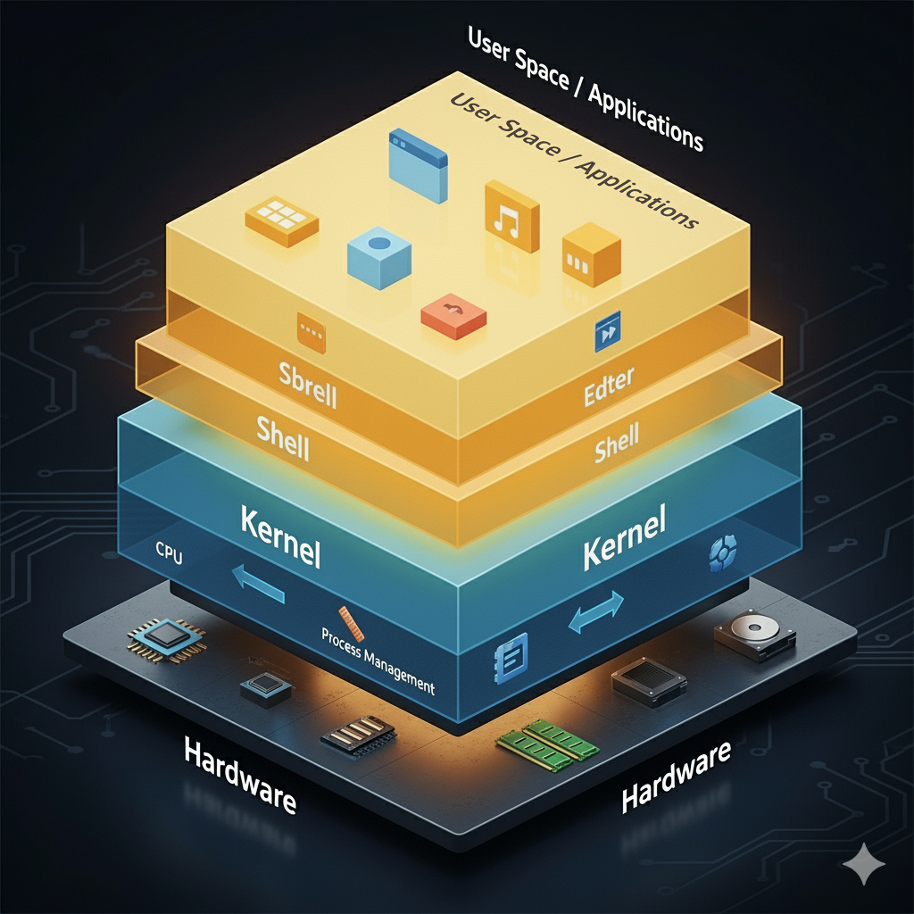

## 리눅스의 개요

- 무료 유닉스 
> 유닉스: 한 대의 컴퓨터에 여러 사람이 동시에 접속해서 각자 다른 프로그램을 실행 가능
> 모든 것을 파일로 취급하는 파일 시스템을 가진 운영체제

> 리누스 토르발스 -> 커널(kernel) 개발

### 리눅스 구조

()

---

#### 용어 정리 

- 커널 
    1. Prepatch
        - 새로운 기술이 포함되지만 안정화 측면에서 떨어질수 있다.
    2. Mainline
        - Prepatch보다 안정적 
    3. Stable
        - 대부분의 버그가 잡힌 안정화된 커널
    4. Longterm
        - 장기 지원 버전
        - 오랫동안 업데이트 지원
    

## VMware 특징

- 1대의 컴퓨터만으로 실무 환경과 거의 비슷한 네트워크 컴퓨터 환경의 구성이 가능
